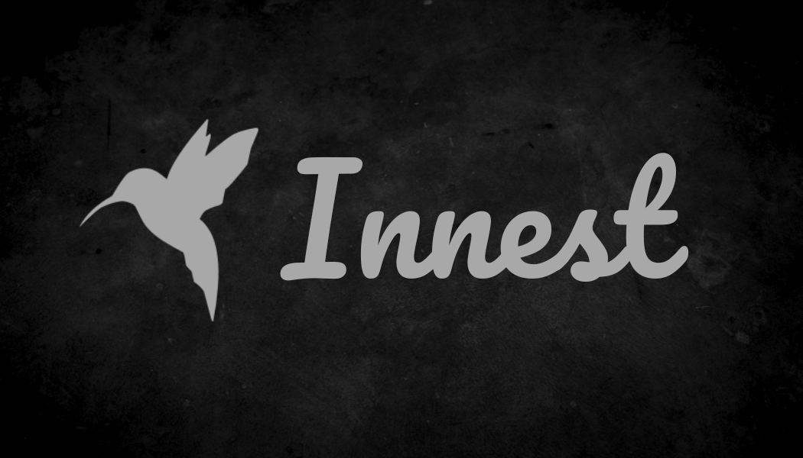

## Hi there 👋
My name is Nguyen Pham Hoang Long, and I’m currently working as a Frontend Developer . I have over 2 years of experience in web application development, particularly in user interface design and optimization. With my skills in HTML, CSS, JavaScript, and modern frontend technologies (Reactjs, NextJs), I always strive to deliver high-quality products and the best user experience. I’m excited to connect and learn with you all!

* 🌍  I'm based in Viet Nam
* 🖥️  See my portfolio at [innest.dev](http://innest.dev)
* ✉️  You can contact me at [nguyenphamhoanglong2000@gmail.com](mailto:nguyenphamhoanglong2000@gmail.com)

# 🌐 Socials:

   

# 💻 Tech Stack:

  

<picture>
  <source media="(prefers-color-scheme: dark)" srcset="https://raw.githubusercontent.com/hoanglong151/hoanglong151/output/github-snake-dark.svg" />
  <source media="(prefers-color-scheme: light)" srcset="https://raw.githubusercontent.com/hoanglong151/hoanglong151/output/github-snake.svg" />
  
</picture>

# 📊 GitHub Stats:

 

<!--
**hoanglong151/hoanglong151** is a ✨ _special_ ✨ repository because its `README.md` (this file) appears on your GitHub profile.

Here are some ideas to get you started:

- 🔭 I’m currently working on ...
- 🌱 I’m currently learning ...
- 👯 I’m looking to collaborate on ...
- 🤔 I’m looking for help with ...
- 💬 Ask me about ...
- 📫 How to reach me: ...
- 😄 Pronouns: ...
- ⚡ Fun fact: ...
-->
